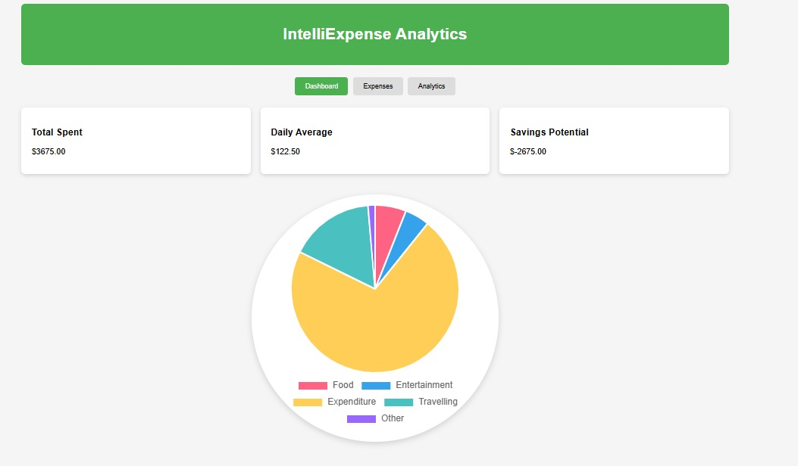
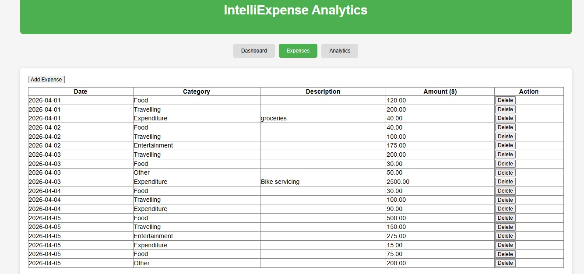
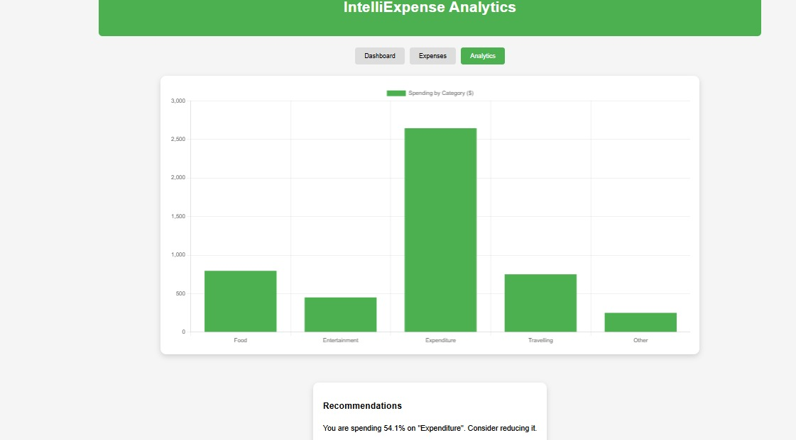

# 💰 IntelliExpense Analytics

> 📊 A smart and interactive web-based expense tracking system with powerful analytics and visual insights.

---

## 🚀 Features

✨ Add and manage daily expenses
📂 Category-wise expense tracking
📊 Interactive **Pie Chart** visualization
📈 Dynamic **Bar Chart** analytics
💡 Smart spending recommendations

---

## 🛠️ Technologies Used

* 🌐 HTML
* 🎨 CSS
* ⚙️ JavaScript
* 📊 Chart.js

---

## ▶️ How to Run

1. 📥 Download or clone the repository
2. 📂 Open the project folder
3. 🌐 Open **index.html** in any browser

---

## 📸 Project Preview

### 🏠 Dashboard

  

---

### 💸 Expenses Page

  

---

### 📊 Analytics

  

---

## 👨‍💻 Author

**Kushal Yadav**

---

## 🌟 Future Improvements

🚀 Add login/signup functionality
📱 Make it mobile responsive
☁️ Connect with database for data storage
📊 Advanced AI-based insights

---

## 📌 Note

This project is built for learning and demonstration purposes.

---

⭐ *If you like this project, don't forget to star the repository!*
